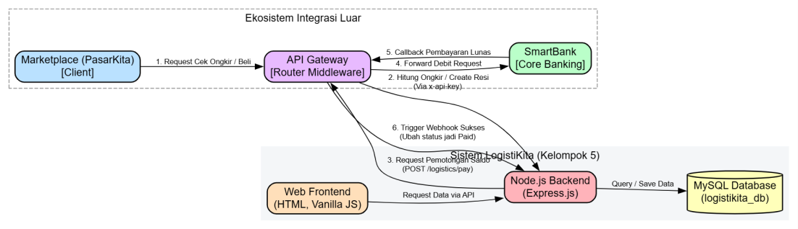
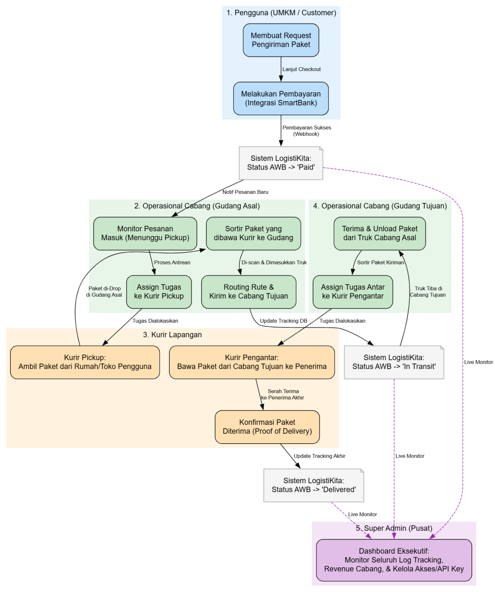
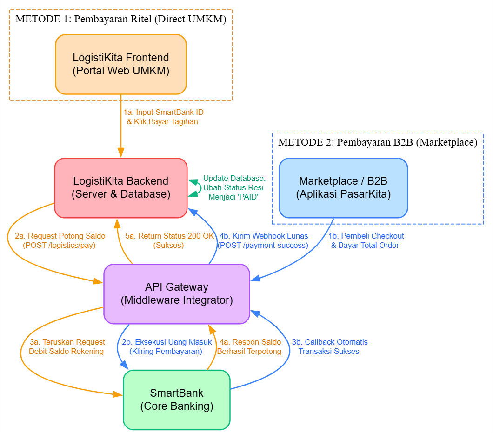

## 1. DESKRIPSI APLIKASI

### 1.1 Gambaran Umum & Tujuan Aplikasi
**LogistiKita** merupakan sebuah sistem layanan jasa ekspedisi logistik dan pengiriman barang yang terpadu, dibangun secara khusus sebagai bagian dari ekosistem simulasi ekonomi UMKM dalam mata kuliah Rekayasa Perangkat Lunak 2. Aplikasi ini dirancang untuk bertindak sebagai *cost driver* utama yang memfasilitasi dan mengamankan alur distribusi fisik barang dari penjual (*merchant*) kepada pembeli akhir (*customer*), sekaligus memvalidasi transaksi secara otomatis melalui integrasi API B2B.

Tujuan utama sistem ini adalah menyediakan antarmuka pengiriman (*request shipment*) dan perhitungan ongkos kirim (*rates*) yang presisi, di mana seluruh skema monetisasi dan pembayarannya terkoneksi secara eksklusif ke sistem perbankan pusat (SmartBank) guna menjaga konsistensi peredaran uang di dalam ekosistem.

### 1.2 Peran dalam Ekosistem & Stakeholder
Dalam arsitektur *microservices* ekosistem ini, LogistiKita berinteraksi secara aktif dengan Marketplace (PasarKita), SupplierHub, API Gateway, dan SmartBank. 

Terdapat lima *stakeholder* utama yang berpartisipasi dalam alur bisnis aplikasi:
1. **UMKM / Pengguna**: Menggunakan platform untuk melakukan permintaan pengiriman ritel dengan otentikasi *passwordless* via SmartBank ID.
2. **Mitra Bisnis (Marketplace & SupplierHub)**: Sistem pihak ketiga yang mengonsumsi *endpoint* B2B API menggunakan autentikasi API Key untuk menciptakan resi (AWB) secara otomatis pasca-*checkout*.
3. **SmartBank (Core Banking)**: Penyelenggara kliring finansial yang mengeksekusi pemotongan saldo pengguna dan memberikan notifikasi pelunasan (*webhook*).
4. **API Gateway (Router Middleware)**: Jembatan utama yang meneruskan lalu lintas *request* dan *callback webhook* antara LogistiKita, Marketplace, dan SmartBank.
5. **Admin Internal & Kurir**: Pengelola operasional yang mengatur data partner integrasi dan secara berkala memutakhirkan status rantai pasok (*tracking logs*) paket.

---

## 2. USE CASE / FITUR UTAMA

Fitur fungsional sistem ini dirancang dengan pendekatan modular berbasis API (*API-First Approach*) untuk memfasilitasi kebutuhan ritel maupun bisnis (B2B):
1. **Hitung Biaya Pengiriman (Rates Calculator)**: Modul komputasi ongkos kirim dinamis berdasarkan parameter kalkulasi jarak (Rp 5.000/km) ditambah bobot volumetrik (Rp 2.000/kg) untuk pengguna retail. Untuk mitra B2B, tersedia skema rute (Reguler/Express) dengan basis harga komersial.
2. **Request Pengiriman (Shipment Booking)**: Modul registrasi paket ke dalam database (mem-generate *Air Waybill* / AWB Number yang unik) serta merekam alamat asal dan tujuan pengiriman. Modul ini terintegrasi langsung dengan trigger inisiasi pembayaran.
3. **Tracking Status (Pelacakan Ekspedisi)**: Fitur untuk mengambil riwayat kronologis pergerakan logistik (contoh: *Pending* ➔ *Picked Up* ➔ *In Transit* ➔ *Delivered*) secara real-time berdasarkan pencarian nomor resi (AWB).
4. **Pembayaran Logistik (SmartBank Payment Integration)**: Modul finansial yang menghasilkan *payment request* dan mengirimkannya secara terenkripsi ke API Gateway untuk dieksekusi oleh SmartBank.
5. **Potongan Biaya Layanan (Monetization Fee)**: Fitur perhitungan rasio pembagian keuntungan (*revenue stream*) yang secara otomatis menyisihkan 5% dari nilai dasar transaksi ongkos kirim sebagai biaya layanan LogistiKita.

---

## 3. DIAGRAM ARSITEKTUR

Berikut adalah representasi visual (menggunakan Graphviz) yang menjelaskan struktur jaringan dan alur kerja operasional aplikasi LogistiKita dari hulu ke hilir.

### 3.1 Diagram Arsitektur Integrasi Ekosistem Luar
**Fokus Penjelasan**: Diagram ini berfokus pada topologi *middleware* dan bagaimana LogistiKita berinteraksi dengan dunia luar. Terlihat jelas pemisahan antara sistem internal LogistiKita (Frontend, Backend, Database) dengan lingkungan eksternal praktikum (Marketplace, SmartBank, API Gateway). Alur panah menunjukkan pertukaran data B2B dan *webhook* pelunasan.



### 3.2 Diagram Alur Operasional Lengkap (Logistik & Pengiriman)
**Fokus Penjelasan**: Diagram ini menitikberatkan pada pergerakan fisik barang dan tugas masing-masing role (pengguna, cabang, kurir, dan admin). Diagram ini menggunakan format *swimlane* kluster yang menunjukkan transisi status paket mulai dari *checkout*, penjemputan oleh kurir (*pickup*), perjalanan antar gudang (*transit*), hingga sampai ke tangan penerima. Super Admin memiliki garis putus-putus yang berarti peran *monitoring* secara langsung dari database.



### 3.3 Diagram Dua Metode Pembayaran (Ritel & B2B)
**Fokus Penjelasan**: Diagram ini khusus menjelaskan pembagian dua metode pelunasan logistik yang didukung oleh sistem (tanpa melibatkan entitas simulator). 
* **Metode 1 (Jalur Oranye)** merupakan pembayaran langsung (ritel) oleh UMKM di portal web LogistiKita, di mana backend akan meminta pemotongan secara *synchronous*.
* **Metode 2 (Jalur Biru)** merupakan *checkout* komprehensif di Marketplace, di mana LogistiKita bersifat pasif dan hanya menunggu notifikasi otomatis (*asynchronous webhook*) dari API Gateway begitu transaksi dikliring oleh SmartBank. 

Pada akhirnya, kedua jalur tersebut bermuara pada status yang sama, yaitu **PAID**.



---

## 4. FLOW PROSES (IPO)

Tabel di bawah ini menjelaskan alur Input-Proses-Output dari fungsionalitas logika sistem untuk setiap modul utama.

| Modul Utama | Input / Parameter | Proses Logika Utama | Output Sistem |
| :--- | :--- | :--- | :--- |
| **Kalkulasi Tarif** | `user_id`, `jarak`, `berat`, `kota_asal`, `tujuan`. | 1. Memvalidasi integritas nilai.<br>2. Menghitung tarif dasar berbasis kilometer dan berat.<br>3. Menambahkan *fee* layanan LogistiKita 5%. | Objek JSON memuat `estimasi_biaya`, `biaya_layanan`, dan `total_biaya`. |
| **Pembuatan Resi (Shipment)** | Detail pengirim, detail penerima, layanan (Reguler/Express), dimensi, API Key. | 1. Memvalidasi API Key mitra.<br>2. Membangkitkan ID Resi (AWB).<br>3. Menginisiasi *request* pembayaran ke SmartBank.<br>4. Mengunci row database awal (*Pending*). | Nomor AWB, data rute pengiriman, dan URL/Status pembayaran eksternal. |
| **Pembaruan Status (Tracking)** | Nomor Resi (`awb_number`), status baru, detail lokasi, ID admin. | 1. Melakukan *database lock* untuk transaksi.<br>2. Memasukkan rekaman waktu log perjalanan ke tabel `tracking_logs`.<br>3. Mengubah status global di tabel `shipments`. | Objek JSON dari riwayat historis pengiriman (*tracking history*). |
| **Pemrosesan Bayar (Payment)** | `order_id`, `user_id`, jumlah tagihan penuh (`amount`). | 1. Membangun *payload* JSON menuju API Gateway.<br>2. Mengirim HTTP POST Request.<br>3. Jika Gateway down, alihkan ke metode fallback (*Simulated SmartBank*). | Status pelunasan (Lunas), ID Transaksi Bank, rekaman transaksi di DB. |

---

## 5. API ENDPOINT

Untuk memastikan standarisasi komunikasi antar sistem yang *stateless*, LogistiKita mengekspos spesifikasi API sebagai berikut:

### 5.1 Endpoint Legacy (Web UMKM Ritel)
* **`POST /logistikita/biaya_pengiriman`**
  * **Request**:
    ```json
    {
      "user_id": "SB-123",
      "jarak": 10,
      "berat": 2
    }
    ```
  * **Response**:
    ```json
    {
      "status": "Success",
      "data": {
        "total": 56700
      }
    }
    ```
* **`POST /logistikita/request_pengiriman`**
  * **Request**:
    ```json
    {
      "user_id": "SB-123",
      "alamat": "Kendari",
      "jarak": 15
    }
    ```
  * **Response**:
    ```json
    {
      "status": "Success",
      "data": {
        "order_id": "ORD-123",
        "status": "Pending"
      }
    }
    ```

### 5.2 Endpoint B2B API (Otentikasi: `x-api-key`)
* **`POST /api/v1/rates`**
  * **Tujuan**: Cek tarif rute pengiriman antar-kota.
* **`POST /api/v1/create-shipment`**
  * **Request**: Detail pengirim, penerima, berat paket, jenis layanan.
  * **Response**:
    ```json
    {
      "status": "Success",
      "data": {
        "awb_number": "LSK999",
        "payment_status": "Pending"
      }
    }
    ```
* **`GET /api/v1/tracking/:awb`**
  * **Tujuan**: Mendapatkan struktur lengkap riwayat perjalanan paket dari tabel tracking.

### 5.3 Endpoint Webhook API Gateway
* **`POST /api/v1/webhook/payment-success`**
  * **Request**:
    ```json
    {
      "awb_number": "LSK999",
      "transaction_id": "TRX-BANK-001"
    }
    ```
  * **Response**:
    ```json
    {
      "status": "Success",
      "message": "Webhook processed, shipment paid."
    }
    ```

---

## 6. INTEGRASI SMARTBANK

Aplikasi LogistiKita tidak mendirikan mekanisme pengelolaan saldo uang tersendiri. Agar tercipta konsistensi finansial pada ekosistem sirkular UMKM, sistem ini menggunakan arsitektur keuangan terpusat (*Centralized Banking Integration*):
1. **Validasi Identitas Passwordless**: LogistiKita memeriksa parameter profil pengguna secara langsung merujuk pada Nomor Rekening SmartBank (SmartBank ID).
2. **Mekanisme Pembayaran Gateway**: Ketika faktur ongkir diterbitkan, LogistiKita melontarkan HTTP POST *payload* berisikan informasi tagihan (`order_id`, nominal) ke API Gateway. API Gateway mengeksekusi instruksi ini terhadap buku besar SmartBank.
3. **Proses Callback Asinkron**: Pembayaran di SmartBank akan memicu rilisnya Webhook otomatis menuju endpoint `/api/v1/webhook/payment-success` milik LogistiKita. Setelah request divalidasi, backend LogistiKita akan memperbarui kolom `payment_status` menjadi “Paid” yang lantas memerintahkan kurir untuk memulai penjemputan fisik barang (*Pick Up*).
4. **Resiliency & Fallback**: Mengantisipasi kendala ketersediaan (*downtime*) pada jaringan API Gateway, LogistiKita menanamkan algoritma fallback simulator yang mampu mencegat antrean tagihan dan menyimulasikan respon HTTP status 200 OK secara virtual.

---

## 7. DESAIN DATABASE

Sistem menggunakan database relasional MySQL 8.x bernama `logistikita_db`. Pemodelan data ini mendukung integritas referensial dan skalabilitas pelacakan pesanan.
* **Tabel `internal_users`**: Tabel master untuk menyimpan otentikasi kurir lapangan dan administrator sistem (Primary Key: `id`).
* **Tabel `partners`**: Menyimpan informasi klien B2B (Marketplace), kunci enkripsi `api_key` yang digeneralisir unik, serta `webhook_url` milik klien.
* **Tabel `shipments`**: Tabel transaksional B2B untuk menyimpan setiap manifest paket (*Air Waybill*). Berelasi Many-to-One ke tabel `partners` dan tabel `internal_users` (`assigned_kurir`).
* **Tabel `orders`**: Tabel legacy pendamping untuk transaksi pengiriman langsung ritel oleh UMKM.
* **Tabel `transactions`**: Buku besar historis yang mengkonsolidasi dan merekam seluruh transaksi monetisasi finansial. Berisi breakdown komponen harga dan `transaction_id` dari SmartBank.
* **Tabel `tracking_logs`**: Entitas untuk menampung riwayat jejak rekam paket. Setiap record mereferensikan resi paket di tabel `shipments` melalui Foreign Key ke kolom `awb_number`.

---

## 8. MEKANISME TRANSAKSI

Struktur transaksi didesain dengan konsep skema monetisasi terdistribusi. Berikut adalah alur flow uang (*Revenue stream*) yang dikalkulasi oleh backend:
1. **Harga Dasar (Base Fee)**: Tarif ongkir konvensional yang dikenakan sebagai penerimaan operasional LogistiKita.
2. **Biaya Layanan Aplikasi (Platform Fee)**: Pajak aplikasi (5% dari tarif dasar) yang dipungut otomatis sebagai profit tambahan LogistiKita (Revenue Murni).
3. **Biaya Kliring Perbankan**: Potongan sebesar 1% oleh SmartBank sebagai penyedia jasa transfer dana virtual account.
4. **Potongan Infrastruktur Middleware**: Biaya pemeliharaan perutean (*routing*) 0,5% yang diambil oleh API Gateway Integrator.

**Contoh Kasus**: Jika estimasi tarif dasar adalah Rp 50.000, maka platform akan membebankan Biaya Layanan 5% (Rp 2.500) kepada pengguna. Nilai ini digabung, sehingga tagihan yang dilesatkan ke gateway bernilai Rp 52.500. Backend akan mencatatkan angka ini ke dalam tabel transaksi `transactions`.

---

## 9. UI SEDERHANA & DOKUMENTASI TIM

### 9.1 Antarmuka (UI)
Antarmuka sistem (UI) dikembangkan dengan arsitektur SPA (*Single Page Application*) parsial menggunakan Vanilla JS dan gaya desain Glassmorphism yang modern, terdiri dari:
* **Halaman Landing Page & Gateway**: Titik masuk pengguna dengan validasi SmartBank ID.
* **Halaman Dashboard UMKM**: Antarmuka monitor KPI pengiriman aktif beserta form permohonan (*Request*) penjemputan barang.
* **Halaman Admin & Kurir Portal**: Ruang kendali untuk memperbarui posisi/koordinat barang yang terintegrasi secara real-time.
* **Halaman Simulator B2B (`kirim.html`)**: Dasbor polling koneksi interaktif 5-langkah yang memonitor arus respons antar-mikroservis (Marketplace - Gateway - SmartBank).

### 9.2 Tim Pengembang
Aplikasi “LogistiKita” diinisiasi dan direkayasa oleh **Wa Ode Nur Alia (Kelompok 5)** secara full-stack dan end-to-end, mencakup seluruh tahap SDLC mulai dari perencanaan, desain ERD, integrasi endpoint API, pengamanan middleware otentikasi, hingga perancangan arsitektur antarmuka HTML/CSS/JS.

---

## 10. SKENARIO PENGUJIAN

Tabel validasi digunakan untuk membuktikan sistem telah memenuhi fungsi utamanya sebelum tahapan demonstrasi praktikum.

| ID Uji | Fitur | Input / Aksi (Request) | Hasil yang Diharapkan (Expected Output) |
| :--- | :--- | :--- | :--- |
| **TC-01** | B2B Create Shipment | Payload rute lengkap dengan header otentikasi `x-api-key` yang valid. | Kode 201 Created. Merespons string AWB (Contoh: `LSK1234`) dengan payment status Pending. |
| **TC-02** | B2B Security (Negatif) | Melakukan Request Create Shipment tanpa melampirkan header `x-api-key`. | Kode 401 Unauthorized. Middleware menolak injeksi dengan log “API Key tidak valid/kosong”. |
| **TC-03** | Pembayaran Ritel | Transmisi order ID dan nominal bayar dari frontend menuju Gateway. | Kode 200 OK. Respon menerbitkan Transaction ID Bank dan merubah status tabel DB menjadi Lunas. |
| **TC-04** | Webhook Pelunasan | SmartBank memanggil Endpoint callback `/webhook/payment-success` milik LogistiKita. | Kode 200 OK. Resi pengiriman B2B berubah dari Pending ke Paid pada database `logistikita_db`. |

---

## 11. KENDALA & SOLUSI

| Hambatan Dihadapi (Masalah) | Resolusi Teknis (Solusi) |
| :--- | :--- |
| Terjadi race condition akibat tabrakan eksekusi dua webhook pembayaran pada waktu bersamaan. | Menerapkan Transaction Logic (`BEGIN`/`COMMIT`) di dalam driver `mysql2` untuk mengunci modifikasi row pada level query DB. |
| Ketidakseragaman payload antar aplikasi mengakibatkan malfungsi sinkronisasi data API Gateway. | Menerbitkan dokumen Standarisasi Kontrak API (API Contract Blueprint) menggunakan konvensi kembalian JSON baku (status, message, data). |
| Respon perbankan berpotensi timeout yang menimbulkan error `Uncaught Promise Rejection` pada Server JS LogistiKita. | Menyematkan blok perintah `try`/`catch` pada seluruh implementasi Axios dengan batas toleransi putus koneksi (*timeout setting*). Ditambah skenario mekanisme isolasi Fallback Simulator. |
