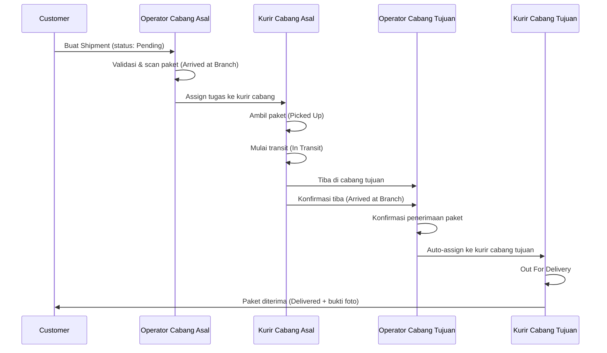
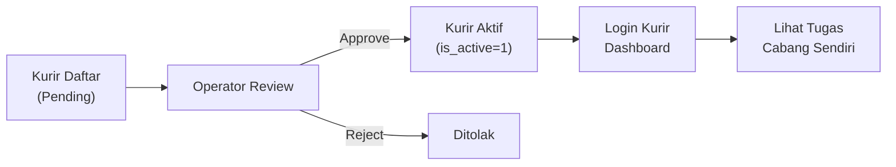

# Sistem Operasional Perpindahan Paket Antar Cabang Realtime

Pengembangan sistem logistik LogistiKita untuk mendukung flow perpindahan paket antar cabang secara realtime, termasuk registrasi kurir per cabang, approval operator, dan live tracking.

## User Review Required

> [!IMPORTANT]
> **Database Migration**: Plan ini memerlukan SQL migration baru yang menambah tabel `branch_routes`, `kurir_registrations`, dan kolom `approval_status` pada `internal_users`. Migration ini **non-destructive** — tidak menghapus data existing.

> [!WARNING]
> **Realtime Mechanism**: Karena project ini tidak menggunakan Socket.IO/WebSocket, realtime akan diimplementasi via **polling interval** (setiap 5-10 detik). Jika Anda ingin menggunakan WebSocket/Socket.IO, beri tahu sebelum implementasi.

> [!IMPORTANT]
> **Tidak perlu install dependency baru** — semua fitur baru menggunakan stack yang sudah ada (Express + mysql2 + vanilla JS).

## Open Questions

> [!NOTE]
> 1. **Rute Cabang**: Apakah rute antar cabang harus dikonfigurasi secara manual oleh Superadmin, atau auto-calculate berdasarkan cabang asal → tujuan?
>    - **Rencana saat ini**: Auto-calculate rute berdasarkan urutan cabang (origin → hub transit → destination), tanpa tabel rute manual.
> 2. **Multi-hop transit**: Apakah paket bisa melewati >1 cabang transit (misal Jakarta→Semarang→Surabaya), atau maksimal 1 hop?
>    - **Rencana saat ini**: Mendukung multi-hop dengan operator secara manual menentukan cabang berikutnya saat scan.

---

## Proposed Changes

### Komponen 1: Database Migration

#### [NEW] [migration_transit_system.sql](file:///c:/Users/nural/Downloads/RPL%20BARU/logistikita/database/migration_transit_system.sql)

Migration SQL baru untuk mendukung seluruh flow:

**Tabel baru: `kurir_registrations`**
- Menyimpan pendaftaran kurir yang menunggu approval operator cabang
- Kolom: `id`, `email`, `password`, `nama`, `phone`, `branch_id`, `status` (pending/approved/rejected), `reviewed_by`, `created_at`

**Alter `internal_users`**
- Tambah kolom `approval_status` ENUM('approved','pending','rejected') DEFAULT 'approved'
- Kurir lama tetap `approved`, pendaftar baru mulai sebagai `pending`

**Alter `shipments`**
- Tambah `transit_route` TEXT (JSON array of branch IDs yang harus dilalui)
- Tambah `current_leg` INT (index leg perjalanan saat ini, 0-based)

**Seed data baru:**
- Tambah kurir tambahan untuk cabang Surabaya, Yogyakarta, Semarang, Denpasar
- Tambah beberapa registrasi kurir pending untuk demo approval

---

### Komponen 2: Backend — Auth (Registrasi Kurir)

#### [MODIFY] [authController.js](file:///c:/Users/nural/Downloads/RPL%20BARU/logistikita/controllers/authController.js)

Tambah endpoint `registerKurir`:
- `POST /auth/register-kurir` — Kurir mendaftar dengan memilih cabang tujuan
- Status default: `pending` (menunggu approval operator cabang)
- Kurir yang belum diapprove **tidak bisa login** (is_active = false)

#### [MODIFY] [authRoutes.js](file:///c:/Users/nural/Downloads/RPL%20BARU/logistikita/routes/authRoutes.js)

- Tambah route `POST /auth/register-kurir`

---

### Komponen 3: Backend — Branch Controller (Approval + Transit)

#### [MODIFY] [branchController.js](file:///c:/Users/nural/Downloads/RPL%20BARU/logistikita/controllers/branchController.js)

Endpoint baru:

| Method | Endpoint | Deskripsi |
|--------|----------|-----------|
| `GET` | `/internal/branches/pending-couriers` | List kurir yang menunggu approval di cabang ini |
| `POST` | `/internal/branches/approve-courier` | Approve registrasi kurir → set `is_active=1`, `approval_status='approved'` |
| `POST` | `/internal/branches/reject-courier` | Reject registrasi kurir |
| `GET` | `/internal/branches/courier-tasks/:id` | Lihat tugas aktif kurir tertentu di cabang |
| `GET` | `/internal/branches/courier-history/:id` | Histori pengiriman kurir tertentu |
| `POST` | `/internal/branches/confirm-receive` | Konfirmasi paket diterima di cabang → otomatis assign ke kurir cabang ini jika ini cabang tujuan akhir |
| `GET` | `/internal/branches/live-tracking` | Live tracking perpindahan paket di cabang (polling endpoint) |
| `GET` | `/internal/branches/all-branches` | List semua cabang (untuk dropdown transit tanpa perlu token superadmin) |

**Upgrade `scanPackage` (existing)**:
- Saat status diubah ke `In Transit` → otomatis update `current_branch_id` ke `next_branch_id`
- Saat operator cabang tujuan mengkonfirmasi paket masuk (`Arrived at Branch`) → tugas otomatis berpindah ke kurir cabang tujuan (round-robin assignment)
- Insert tracking log di setiap perubahan status dengan `branch_id`

#### [MODIFY] [internalRoutes.js](file:///c:/Users/nural/Downloads/RPL%20BARU/logistikita/routes/internalRoutes.js)

- Tambah semua route baru dari branchController di atas

---

### Komponen 4: Backend — Kurir Controller (Branch-Scoped Tasks)

#### [MODIFY] [kurirController.js](file:///c:/Users/nural/Downloads/RPL%20BARU/logistikita/controllers/kurirController.js)

Upgrade existing + endpoint baru:

| Method | Endpoint | Deskripsi |
|--------|----------|-----------|
| `GET` | `/internal/kurir/available` | **Upgrade**: Hanya tampilkan paket yang `current_branch_id` = kurir's `branch_id` |
| `GET` | `/internal/kurir/mine` | **Upgrade**: Tambah info leg perjalanan dan cabang tujuan berikutnya |
| `POST` | `/internal/kurir/take` | **Upgrade**: Validasi kurir hanya bisa ambil paket dari cabang sendiri |
| `POST` | `/internal/kurir/arrive-branch` | Kurir konfirmasi tiba di cabang berikutnya → status `Arrived at Branch`, `current_branch_id` update |
| `GET` | `/internal/kurir/branch-info` | Info cabang tempat kurir terdaftar |

---

### Komponen 5: Frontend — Login Page (Registrasi Kurir)

#### [MODIFY] [login.html](file:///c:/Users/nural/Downloads/RPL%20BARU/logistikita/public/login.html)

- Tambah tab **"Daftar Kurir"** di sebelah tab Login dan Register Customer
- Form: Nama, Email, Password, Telepon, **Pilih Cabang** (dropdown)
- Setelah submit → tampilkan pesan sukses bahwa pendaftaran menunggu approval operator cabang

#### [MODIFY] [login.js](file:///c:/Users/nural/Downloads/RPL%20BARU/logistikita/public/js/login.js)

- Tambah handler `handleRegisterKurir(e)` untuk submit form registrasi kurir
- Fetch daftar cabang aktif untuk populate dropdown

---

### Komponen 6: Frontend — Branch Dashboard (Major Upgrade)

#### [MODIFY] [branch-dashboard.html](file:///c:/Users/nural/Downloads/RPL%20BARU/logistikita/public/branch-dashboard.html)

Tambah sidebar menu baru dan tab content:

**Tab baru: Approval Kurir**
- List pendaftaran kurir yang menunggu persetujuan
- Tombol Approve / Reject per registrasi
- Setelah disetujui, kurir otomatis muncul di daftar Staf Kurir Cabang

**Tab baru: Live Tracking**
- Visualisasi perpindahan paket antar cabang (card-based timeline)
- Status setiap paket dengan indikator cabang saat ini
- Auto-refresh setiap 5 detik

**Upgrade Tab: Staf Kurir Cabang**
- Tambah info tugas aktif per kurir (jumlah paket yang sedang diantar)
- Histori pengiriman per kurir (klik kurir → expand detail)
- Badge status kurir (Aktif / Dalam Misi / Off Duty)

**Upgrade Tab: Ringkasan Cabang**
- Tambah stat card "Kurir Aktif" dan "Paket Masuk Hari Ini"
- Tambah bagian "Paket Masuk Perlu Konfirmasi" — operator klik untuk konfirmasi penerimaan

#### [MODIFY] [branch-dashboard.js](file:///c:/Users/nural/Downloads/RPL%20BARU/logistikita/public/js/branch-dashboard.js)

- Implementasi semua handler untuk fitur baru di atas
- Auto-polling `loadLiveTracking()` setiap 5 detik
- Handler approve/reject kurir
- Handler konfirmasi penerimaan paket
- Render tugas kurir dan histori

---

### Komponen 7: Frontend — Kurir Dashboard (Upgrade)

#### [MODIFY] [kurir.html](file:///c:/Users/nural/Downloads/RPL%20BARU/logistikita/public/kurir.html)

Upgrade existing:
- Tambah info **Cabang Asal** di header (badge cabang tempat kurir terdaftar)
- Tambah tab **"Transit Antar Cabang"** — daftar tugas membawa paket ke cabang lain
- Tombol "Konfirmasi Tiba di Cabang" saat kurir sampai di cabang tujuan transit
- Info leg perjalanan di setiap card paket

#### [MODIFY] [kurir.js](file:///c:/Users/nural/Downloads/RPL%20BARU/logistikita/public/js/kurir.js)

- Upgrade `loadAvailableShipments` → filter by branch
- Tambah `loadTransitTasks()` untuk tab transit antar cabang
- Handler `confirmArriveAtBranch(awb)` — kurir tiba di cabang berikutnya
- Tampilkan info cabang kurir di header

---

## Verification Plan

### Automated Tests

1. **Start server**: `npm start` → pastikan tidak ada error
2. **Test registrasi kurir**: POST `/auth/register-kurir` dengan data kurir baru → expect status pending
3. **Test login kurir pending**: Login dengan kurir yang belum diapprove → expect ditolak
4. **Test approval**: Branch admin approve kurir → login kurir berhasil
5. **Test branch-scoped tasks**: Kurir cabang Jakarta hanya melihat paket di cabang Jakarta
6. **Test transit flow**:
   - Operator cabang asal scan paket → status "In Transit"
   - Kurir cabang asal membawa paket ke cabang berikutnya
   - Kurir confirm tiba → status "Arrived at Branch"
   - Operator cabang tujuan konfirmasi → tugas berpindah ke kurir cabang tujuan
   - Kurir cabang tujuan mengantar ke customer → bukti delivery

### Manual Verification (Browser)

1. Buka `http://localhost:3000/login.html` → cek tab "Daftar Kurir" muncul dan berfungsi
2. Login sebagai Branch Admin Jakarta → cek tab Approval Kurir, Live Tracking, dan info kurir di Staf Kurir
3. Login sebagai Kurir Jakarta → cek hanya paket Jakarta yang muncul, tab transit tersedia
4. Simulasi full flow: Customer buat shipment → operator scan → kurir transit → operator tujuan konfirmasi → kurir last-mile deliver

---

## Diagram Alur Sistem

